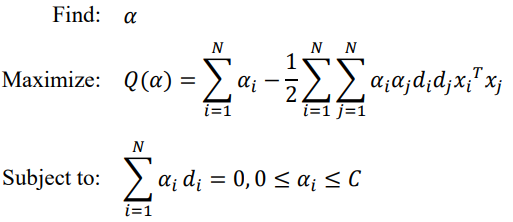
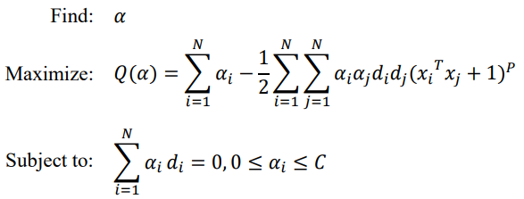
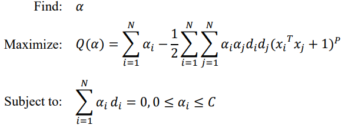
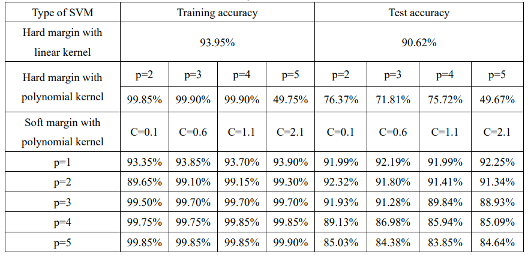
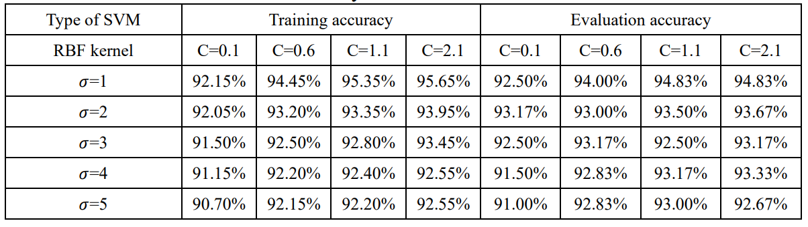

## Introduction
The Spam Data Set saved in the matrix with 57 attributes of a feature vector. We apply hard-margin SVM of linear kernel, hard-margin SVM of polynomial kernel and soft-margin of polynomial kernel. We calculated the discriminant function and get the optimal hyperplane of each case. Then we calculated the training and testing accuracy of each case with different hyperparameters and do comparison. 

We also use the RBF SVM model to this dataset and form the evaluation set to assess the performance of RBF SVM model. We calculate the training and evaluation accuracy of different hyperparameters of RBF method and do analysis.

## Data pre-processing
We standardize the data by removing the mean value of each feature and then dividing by each feature’s standard deviation. We normalize the training and testing data with the equation.

## Compute discriminant function
 * Admissibility of the kernels
 We compute the Gram matrix with Mercer’s condition and calculate all the eigenvalues of the matrix. The matrix K contains some very small negative values. We set a very small negative value 10^-4 as the threshold. As long as there is no eigenvalues smaller than it, then we believe the matrix is positive semi-definite and the kernel candidate is admissible which ensures that the SVM optimization problem is convex and has a unique global minimum. 

 * A hard-margin SVM with the linear kernel
 The margin with the linear kernel can separate two classes of data if and only if there exist a hyper plane which w is the weight vector and the b is the bias. In order to find an optimal hyper plane, we can apply the dual problem and use the KKT conditions. The object of our task :

 

 * A hard-margin SVM with the polynomial kernel
 The hard-margin with a polynomial kernel  which p range from 2 to 5. Then we apply the KKT condition and reduce unknowns to form the dual problem:

  

 * A soft-margin SVM with the polynomial kernel
 All of other calculation steps are the same as 3.2 and the only difference is the boundary of a. Value C reflects cost of violating constraints. A large C leads to smaller margin and fewer misclassification and a small C leads to larger margin and more misclassification of training data. According to the KKT condition and we can form the dual problem:

  

## Training and testing accuracy calculation
 * After the calculation of training and testing accuracy with all the kernels mentioned above, we can get the results:

  

## Radial Basis Function (RBF) kernel and implementation
 * RBF kernel is a type of non-linear kernel that maps data to a higher-dimensional feature space, where it can be more easily separable.  The RBF kernel is defined as formular 
of which the exponential is the squared Euclidean distance between two feature vectors and 𝛾 is a scalar that defines how much influence a single training example. 

$$ K({x}_{1},{x}_{2})={e}^{-\gamma {||{x}_{1}-{x}_{2}||}^{2}} $$

$$ \gamma =\frac {1} {nfeatures*sigm{a}^{2}}=\frac {1} {57\ast \sigm {a}^{2}} $$

* We can get the results of RBF method:

